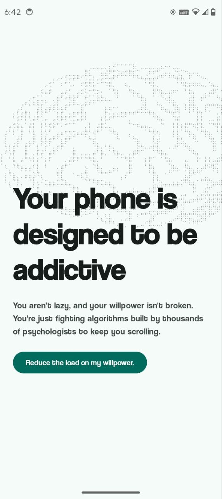
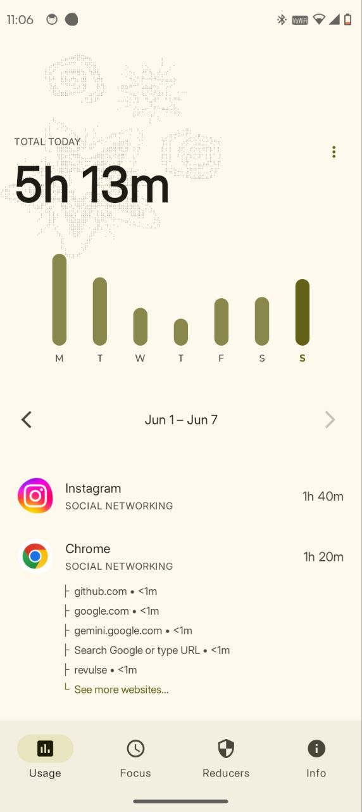
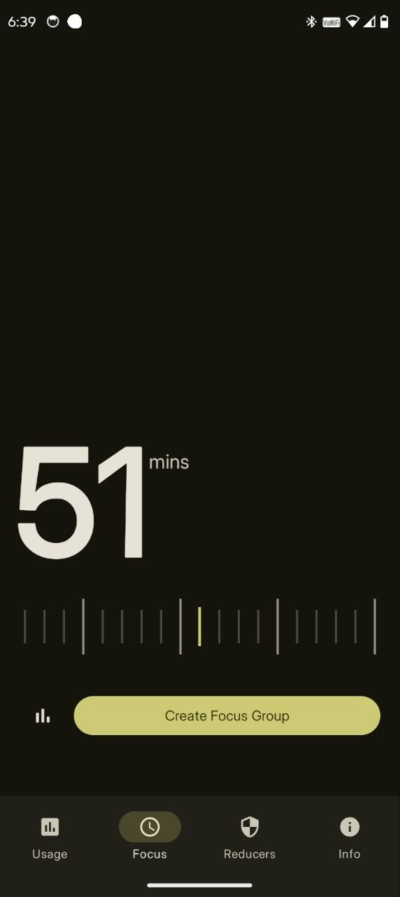
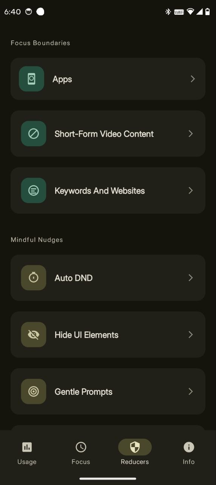

  
   <h2>Curbox</h2>
   
   
   
   

Curbox is a powerful open source utility for Android built to help you reclaim your time and master your digital habits. It provides a suite of tools designed to break the cycle of screen addiction through granular control and deep insights.

### Screenshots
Click on any image to enlarge it.

<table>
	<tr>
		<td></td>
		<td></td>
		<td></td>
		<td></td>
	</tr>
</table>

### Why Curbox Stands Out

Most screen time tools are closed source and require internet access. This raises concerns about your private usage data being tracked or sold. Curbox takes a different path.
* All screen time apps use a powerful Android feature (Accessibility service) that lets them see everything you do, including your private messages. They all connect to internet posing a severe security threat. Curbox uses this same feature, but it does not have internet access (it doesn't declare the permission in manifest). This means your personal data can never leave your phone, keeping it completely private and secure.
* Open Source Transparency
The entire codebase is public. Anyone can verify how the app works. This ensures there are no hidden trackers or malicious behaviors. Open source doesn't mean anyone can see how you use the app. 
* Respect for Your Data
Because there is no cloud connection, you are the sole owner of your statistics. There are literally a few companies selling your usage insights for billions so the algorithm can be further strengthened to keep you trapped.

### In Depth Feature Analysis

Curbox goes beyond simple app timers. It targets the specific triggers that lead to mindless scrolling.
- BLock apps
- Block Instagram reels, Youtube Shorts
- Block Websites
- App usage insights
- Website usage insights
- Block parts of UI (eg. Block the entire youtube home feed while allowing searches)
- Focus Mode (temporarily pause apps/websites to focus on your work)
- Focus statistics
- Schedule DND to turn on automatically
- Set Grayscale filter to only specific apps (eg. put grayscale to instagram while no grayscale to camera)
- Show a live count of how much short form content you've scrolled while you scroll
- Show a live timer showing how much time has elapsed ever since you opened the app on the app itself
- Qr/Barcode based app/website unlocking
- Automatically redirect to a different website when blocked website accessed
- Block only specific url paths (eg. block m.youtube.com/shorts/* but allow m.youtube.com)
- Block entities based on usage (eg. block if i use whatsapp more than 1 hour) or Time (allow whatsapp only between 7 am to 9pm)
- Home screen widgets
  
App/Website unlock mechanisms (specifiy what happens when you try opening the app out of its schedule)
- Complete blockade with no access
- Prefix a time (like 5mins) for each subsequent unlocks
- Dynamic time selection on each subsequent unlocks
- Qr/Bar code based unlock (use qr code from existing product boxes like books, spread them across your home, physically move to the spot to unlock app each time)
- Requires physically typing a sentence (eg type "I am giving up on my goals to use this app right now" to unlock)

### How to install
The app is not yet released. Howsoever you could test the beta versions from either our discord or telegram groups. Beta apps are also available on the github actions page.

### Contributing

We welcome contributions from the community! If you want to help improve Curbox, please follow these steps:

1. Fork the repository.
2. Create a new branch for your feature or bugfix.
3. Commit your changes with a clear message.
4. Push to your branch.
5. Create a new Pull Request.

Developing for accessibility services and blockers is complex. It requires understanding how different apps structure their views. We appreciate any help in discovering new ways to block distracting content.

### Special Thanks
* All my beloved donators and sponsers
* Digipaws: inspiration for the entire code structure and working mechanism
* Usage Direct: For help with app usage statistics.
* Redd Focus: For the foundation of the view blocker system.
* ShizuTools: For Shizuku runner implementations.
* MPAndroidChart: For the beautiful graphs and charts.

### License

Curbox is licensed under the GPL 3 or later license. You are free to use, modify, and distribute this software in accordance with the license.

### Contact

For questions or feedback, please open an issue on the GitHub repository or reach out:
* Discord: @nethical
* Telegram: @nethicalps
* Email: aguptaq88@gmail.com
